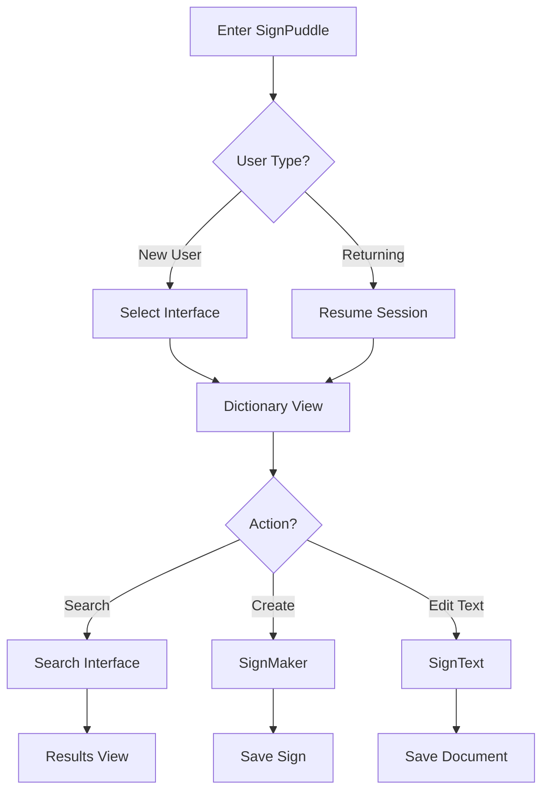

# SignPuddle 2 Comprehensive Architecture Analysis

## Executive Summary

SignPuddle 2 is a comprehensive web application system for creating, editing, and managing SignWriting dictionaries and documents. This analysis examines the legacy PHP codebase from the perspectives of software architecture, development, and product management to provide a complete understanding of the system's complexity, challenges, and modernization opportunities.

## Table of Contents

1. [System Overview](#system-overview)
2. [Legacy Architecture Analysis](#legacy-architecture-analysis)
3. [Core Components Deep Dive](#core-components-deep-dive)
4. [Data Models and Formats](#data-models-and-formats)
5. [User Interface and Experience](#user-interface-and-experience)
6. [Security and Authentication](#security-and-authentication)
7. [Performance and Scalability](#performance-and-scalability)
8. [Technology Stack Assessment](#technology-stack-assessment)
9. [Modernization Strategy](#modernization-strategy)
10. [Migration Roadmap](#migration-roadmap)
11. [Risk Assessment](#risk-assessment)
12. [Recommendations](#recommendations)
13. [Key Files and Their Purpose](#key-files-and-their-purpose)
14. [Modern Architecture Recommendation](#modern-architecture-recommendation)

## System Overview

### Purpose and Mission
SignPuddle 2 serves as a digital platform for creating and managing SignWriting dictionaries. SignWriting is a visual notation system for sign languages invented by Valerie Sutton in 1974, allowing sign languages to be written and documented systematically.

### Key Stakeholders
- **Sign Language Communities**: Primary users creating and maintaining dictionaries
- **Educators**: Teachers using SignWriting for instruction
- **Researchers**: Linguists studying sign languages
- **Software Developers**: Maintaining and extending the platform

### Core Value Propositions
1. **Dictionary Creation**: Tools for building comprehensive sign language dictionaries
2. **Sign Composition**: Visual editor for creating individual signs using SignWriting notation
3. **Text Composition**: Tools for creating documents with sequences of signs
4. **Collaboration**: Sharing dictionaries and signs across communities
5. **Format Support**: Multiple SignWriting format conversions (FSW, KSW, BSW, CSW)

## Legacy Architecture Analysis

### High-Level Architecture

The current system follows a traditional LAMP stack architecture with several concerning patterns:

```
┌─────────────────┐    ┌─────────────────┐    ┌─────────────────┐
│   Web Browser   │◄──►│   Apache/PHP    │◄──►│  File System    │
│                 │    │                 │    │   + SQLite      │
│ - JavaScript    │    │ - Session Mgmt  │    │ - SPML Files    │
│ - Dynamic UI    │    │ - File I/O      │    │ - Symbol Data   │
│ - AJAX Calls    │    │ - Format Conv.  │    │ - User Data     │
└─────────────────┘    └─────────────────┘    └─────────────────┘
```

### Critical Architectural Issues

#### 1. **Session-Heavy State Management**
- Extensive use of `$_SESSION` variables for application state
- State scattered across multiple session keys (`$_SESSION['SGN']`, `$_SESSION['UI']`, etc.)
- No clear session lifecycle management
- Memory intensive for concurrent users

#### 2. **Monolithic File Structure**
- Single `global.php` file (1,560 lines) handling configuration, routing, and utilities
- Mixed concerns within individual files
- Tight coupling between presentation and business logic

#### 3. **File-Based Data Storage**
- Primary data storage in XML (SPML) format
- Memory-intensive XML parsing for each request
- No transaction support or ACID compliance
- Concurrent access issues

#### 4. **Format Complexity**
The system supports multiple SignWriting formats with complex conversions:
- **FSW (Formal SignWriting)**: String-based representation
- **KSW (Kartesian SignWriting)**: Coordinate-based format
- **BSW (Binary SignWriting)**: Binary encoding
- **CSW (Character SignWriting)**: Character-based encoding

## Core Components Deep Dive

### 1. Entry Management System

#### Primary Files
- `canvas.php` (421 lines): Central sign editing interface
- `signsave.php`: Sign persistence layer
- `signmaker.php`: Sign creation interface initialization
- `signtext.php`: Sign sequence editor initialization

#### Functionality Analysis
```php
// Canvas.php - Central editing hub
switch ($action){
    case "new":     // Create new entry
    case "Add":     // Add entry to dictionary
    case "Save":    // Save changes
    case "Delete":  // Remove entry
}
```

**Strengths:**
- Comprehensive CRUD operations
- Support for rich metadata (terms, definitions, sources, videos)
- Version tracking through creation/modification timestamps

**Weaknesses:**
- Single large switch statement handling all operations
- Mixed HTML generation and business logic
- No input validation or sanitization
- Direct file system manipulation without error handling

### 2. Search and Discovery System

#### Primary Files
- `searchword.php` (339 lines): Word-based search
- `searchsign.php`: Sign-based search
- `searchsymbol.php`: Symbol-based search
- `searchgroup.php`: Group-based search

#### Search Capabilities
1. **Text Search**: Full-text search across sign terms and definitions
2. **Sign Search**: Visual pattern matching in SignWriting notation
3. **Symbol Search**: Individual symbol lookup
4. **Frequency Analysis**: Symbol usage statistics

**Technical Implementation:**
```php
// Search types supported
$type = $_REQUEST['type'];
switch($type) {
    case "any":     // Contains search
    case "start":   // Starts with search  
    case "exact":   // Exact match search
}
```

**Limitations:**
- No full-text indexing
- Linear search through XML files
- No search result caching
- Limited fuzzy matching capabilities

### 3. SignWriting Format Engine

#### Format Libraries
- `msw.php` (400 lines): Modern SignWriting core library
- `fsw.php`: Formal SignWriting format
- `ksw.php`: Kartesian SignWriting format
- `bsw.php`: Binary SignWriting format
- `csw.php`: Character SignWriting format

#### Key Functions Analysis
```php
// Core format operations
function isVert($text)        // Detect vertical layout
function validKey($key)       // Validate symbol keys
function reorient($text)      // Handle orientation changes
function ksw2fsw($ksw)       // Format conversions
function fsw2ksw($fsw)       // Reverse conversions
```

**Conversion Matrix:**
```
    FSW   KSW   BSW   CSW
FSW  ✓     ✓     ✓     ✓
KSW  ✓     ✓     ✓     ✓
BSW  ✓     ✓     ✓     ✓
CSW  ✓     ✓     ✓     ✓
```

### 4. User Interface System

#### JavaScript Architecture
- `signmaker.js` (712 lines): Sign creation interface
- `signtext.js`: Sign sequence editor
- `keyISWA.js`: Symbol keyboard interface
- `sequence.js`: Sign sequence management

**Current UI Patterns:**
```javascript
// Dynamic layer creation
create = new DynLayer(null,padX,padY,720,1400)
signBox = new box()
for (var i=0; i<6;i++){
    for (var j=0; j<16;j++){
        var keyX=new key(i,j)
        create.addChild(keyX)
    }
}
```

**UI Framework Dependencies:**
- DynAPI: Legacy dynamic content library
- Custom drag-and-drop implementation
- Direct DOM manipulation
- No modern component architecture

### 5. Data Persistence Layer

#### Storage Mechanisms
1. **SPML Files**: Primary dictionary storage in XML format
2. **Session Data**: Temporary state in PHP sessions
3. **File System**: Symbol data and assets
4. **SQLite**: Symbol metadata (iswa.sql3)

#### SPML Format Structure
```xml
<?xml version="1.0" encoding="UTF-8"?>
<spml root="http://www.signbank.org/signpuddle1.6" type="sgn" puddle="4">
  <entry id="1" cdt="1311183542" mdt="1311183729" usr="Val">
    <term>AS17620S15a18S22a02M523x514S15a18478x487S22a02508x495S17620491x494</term>
    <term><![CDATA[test zero]]></term>
    <text><![CDATA[we are testing SignPuddle 1.6]]></text>
    <video><![CDATA[<iframe>...</iframe>]]></video>
    <src><![CDATA[Val ;-)]]></src>
  </entry>
</spml>
```

## Data Models and Formats

### Core Entities

#### 1. Dictionary (Puddle)
```php
// Implicit structure from code analysis
$puddle = [
    'id' => int,
    'type' => 'sgn'|'ui',
    'name' => string,
    'description' => string,
    'created' => timestamp,
    'modified' => timestamp,
    'entries' => Entry[]
];
```

#### 2. Sign Entry
```php
$entry = [
    'id' => int,
    'cdt' => timestamp,      // Created date
    'mdt' => timestamp,      // Modified date  
    'usr' => string,         // User
    'terms' => string[],     // FSW notation + text terms
    'text' => string,        // Definition/description
    'video' => string,       // Embedded video HTML
    'src' => string,         // Source attribution
    'build' => string,       // Internal build format
    'sequence' => string     // Sign sequence data
];
```

#### 3. Symbol
```php
$symbol = [
    'key' => string,         // ISWA symbol key (e.g., "S10000")
    'category' => string,    // hands, movement, face, etc.
    'group' => string,       // Symbol group within category
    'base' => string,        // Base symbol code
    'fill' => int,          // Fill variation (1-6)
    'rotation' => int,      // Rotation (0-7)
    'name' => string,       // Human readable name
    'svg' => string         // SVG path data
];
```

### Format Specifications

#### Formal SignWriting (FSW)
- **Structure**: `M[width]x[height]S[symbol][x][y]...`
- **Example**: `M525x535S10000492x467S26500508x534`
- **Usage**: Primary storage format, URL-safe

#### Kartesian SignWriting (KSW)  
- **Structure**: Coordinate-based with lanes (L/M/R)
- **Usage**: Layout and rendering calculations
- **Features**: Supports vertical text layout

#### SignWriting Markup Language (SPML)
- **Format**: XML-based dictionary format
- **DTD**: `http://www.signpuddle.net/spml_1.6.dtd`
- **Features**: Rich metadata, versioning, user attribution

## User Interface and Experience

### Current Interface Architecture

#### Page Types and Navigation
1. **Landing Page** (`index.php`): UI selection interface
2. **Search Interfaces**: Word, sign, symbol, and group search
3. **Editing Interfaces**: SignMaker and SignText editors
4. **Management Interfaces**: Dictionary and user management

#### User Journey Analysis



#### Usability Issues Identified

1. **Complex Navigation**: Multi-level state management confusing to users
2. **Inconsistent UI**: Different interfaces use different design patterns
3. **Mobile Incompatibility**: Fixed-width layouts, mouse-dependent interactions
4. **Performance**: Slow page loads due to XML parsing
5. **Accessibility**: Limited keyboard navigation, no screen reader support

### Interface Component Analysis

#### SignMaker Interface
```javascript
// Key interaction patterns
DragEvent.enableDragEvents(keyX)  // Symbol dragging
buildControl()                    // Control panel generation
updateKeys(category)              // Symbol palette updates
```

**Strengths:**
- Visual drag-and-drop interface
- Real-time sign preview
- Symbol categorization

**Weaknesses:**
- No touch support
- Browser compatibility issues
- No undo/redo functionality

## Security and Authentication

### Current Security Model

#### Authentication System
```php
// User session management
$num = $_SESSION['num'];
$security = 0;  // Security level (0-3)

// Security levels:
// 0: Anonymous browsing
// 1: Basic user (search)
// 2: Editor (create/edit)
// 3: Admin (full access)
```

#### Authorization Patterns
```php
if ($security > 0) {
    // Allow search operations
}
if ($security > 1) {
    // Allow sign creation
}
if ($security > 2) {
    // Allow dictionary management
}
```

### Security Vulnerabilities Identified

#### 1. **Input Validation**
- No input sanitization on user data
- Direct inclusion of user content in pages
- SQL injection potential in future database migration

#### 2. **Session Management**
- Session data stored in files without encryption
- No session timeout mechanisms
- Predictable session identifiers

#### 3. **File System Access**
- Direct file system operations based on user input
- No path traversal protection
- Unrestricted file uploads

#### 4. **Cross-Site Scripting (XSS)**
```php
// Dangerous pattern found throughout codebase
echo $_REQUEST['userInput'];  // No escaping
```

#### 5. **Authentication Bypass**
```php
// Backdoor mechanism in styleA.php
if(@$_REQUEST['backdoor']){
    $_SESSION['backdoor'] = $_REQUEST['backdoor'];
}
```

## Performance and Scalability

### Current Performance Characteristics

#### Bottlenecks Identified

1. **XML Processing Overhead**
   - Full XML parsing for each dictionary access
   - No caching mechanisms
   - Memory usage scales with dictionary size

2. **Session Storage**
   - Large session objects stored in files
   - Session cleanup not implemented
   - Disk I/O for every request

3. **Symbol Rendering**
   - Dynamic image generation for each symbol
   - No CDN or caching for symbol assets
   - Repeated format conversions

#### Scalability Limitations

```php
// Memory-intensive operations
function pack_spml($type, $pid) {
    set_time_limit(60);  // Indicates performance issues
    // Loads entire dictionary into memory
}
```

**Current Capacity Estimates:**
- **Concurrent Users**: ~10-20 (limited by session storage)
- **Dictionary Size**: ~1,000-5,000 entries (XML parsing limits)
- **Storage**: Limited by file system performance

**Growth Constraints:**
- File-based storage doesn't scale horizontally
- Session-based architecture prevents load balancing
- No separation between read and write operations

## Technology Stack Assessment

### Current Stack Analysis

#### Backend Technologies
```php
// Core dependencies identified
- PHP 5.x/7.x (legacy version requirements)
- Apache HTTP Server
- SQLite 3 (limited usage)
- ImageMagick (image processing)
- File system storage
```

#### Frontend Technologies
```javascript
// Client-side dependencies
- DynAPI (legacy dynamic content library)
- Custom JavaScript frameworks
- jQuery-style DOM manipulation
- Canvas-based rendering
```

#### External Dependencies
- ISWA (International SignWriting Alphabet) data
- Font files for SignWriting rendering
- External video embedding support

### Technology Debt Assessment

#### High Priority Issues
1. **PHP Version**: Running on legacy PHP without security updates
2. **JavaScript Libraries**: Using deprecated libraries with no maintenance
3. **No Build Process**: Manual file management and deployment
4. **No Testing Framework**: No automated testing infrastructure
5. **No Version Control**: Code versioning not evident in analysis

#### Medium Priority Issues
1. **CSS Framework**: No modern CSS framework or component system
2. **Browser Compatibility**: Limited support for modern browsers
3. **Mobile Support**: No responsive design implementation
4. **Accessibility**: No ARIA labels or keyboard navigation

## Modernization Strategy

### Modern Architecture Vision

#### Microservices Architecture
```
┌─────────────────┐    ┌─────────────────┐    ┌─────────────────┐
│   Svelte SPA    │    │   C# API        │    │   Database      │
│                 │    │                 │    │                 │
│ - Component     │◄──►│ - Controllers   │◄──►│ - PostgreSQL    │
│ - State Mgmt    │    │ - Services      │    │ - Redis Cache   │
│ - PWA Support   │    │ - Repositories  │    │ - File Storage  │
└─────────────────┘    └─────────────────┘    └─────────────────┘
```

#### Technology Stack Modernization

**Frontend (Svelte)**
```javascript
// Modern component architecture
- Svelte 4+ for reactive components
- TypeScript for type safety
- Vite for build tooling
- PWA capabilities
- Modern CSS (CSS Grid, Flexbox)
```

**Backend (C# .NET)**
```csharp
// Clean architecture implementation
- ASP.NET Core 8+ Web API
- Entity Framework Core
- Repository pattern
- Dependency injection
- JWT authentication
```

**Database Layer**
```sql
-- Normalized data structure
- PostgreSQL for primary data
- Redis for session/cache
- File storage for assets
- Full-text search indexing
```

### Component Migration Strategy

#### Phase 1: Data Migration
1. **SPML to Database**: Convert XML dictionaries to relational structure
2. **User Data**: Migrate user accounts and permissions
3. **Symbol Data**: Normalize ISWA symbol information
4. **Media Assets**: Organize and catalog image/video content

#### Phase 2: API Development
```csharp
// Core API endpoints
[Route("api/[controller]")]
public class SignController : ControllerBase
{
    [HttpGet]
    public async Task<IActionResult> GetSigns([FromQuery] SearchRequest request)
    
    [HttpPost]
    public async Task<IActionResult> CreateSign([FromBody] SignRequest request)
    
    [HttpPut("{id}")]
    public async Task<IActionResult> UpdateSign(int id, [FromBody] SignRequest request)
}
```

#### Phase 3: Frontend Development
```svelte
<!-- Modern component structure -->
<script>
  import { signStore } from '../stores/signStore.js';
  import SignEditor from '../components/SignEditor.svelte';
  import SymbolPalette from '../components/SymbolPalette.svelte';
</script>

<div class="sign-maker">
  <SignEditor bind:sign={$signStore.currentSign} />
  <SymbolPalette on:symbolSelect={handleSymbolSelect} />
</div>
```

## Migration Roadmap

### Phase 1: Foundation (Months 1-3)
**Objectives**: Establish modern development infrastructure

**Tasks:**
1. **Development Environment Setup**
   - Git repository initialization
   - CI/CD pipeline configuration
   - Testing framework setup
   - Development containerization

2. **Data Analysis and Modeling**
   - Complete SPML format documentation
   - Design normalized database schema
   - Create data migration scripts
   - Establish data validation rules

3. **Security Audit**
   - Identify all security vulnerabilities
   - Implement secure coding standards
   - Design authentication/authorization system
   - Plan security testing procedures

**Deliverables:**
- Modern development environment
- Complete data model documentation
- Security assessment report
- Migration scripts (initial version)

### Phase 2: Backend Development (Months 4-6)
**Objectives**: Build robust API foundation

**Tasks:**
1. **Core API Development**
   ```csharp
   // Service layer architecture
   public interface ISignService
   {
       Task<SignDto> GetSignAsync(int id);
       Task<SignDto> CreateSignAsync(CreateSignRequest request);
       Task<IEnumerable<SignDto>> SearchSignsAsync(SearchRequest request);
   }
   ```

2. **Database Implementation**
   ```sql
   -- Core tables structure
   CREATE TABLE Dictionaries (
       Id SERIAL PRIMARY KEY,
       Name VARCHAR(255) NOT NULL,
       Language VARCHAR(10) NOT NULL,
       OwnerId UUID REFERENCES Users(Id),
       Created TIMESTAMP DEFAULT NOW()
   );
   
   CREATE TABLE Signs (
       Id SERIAL PRIMARY KEY,
       DictionaryId INT REFERENCES Dictionaries(Id),
       Fsw TEXT NOT NULL,
       Gloss TEXT,
       Created TIMESTAMP DEFAULT NOW()
   );
   ```

3. **Format Conversion Services**
   ```csharp
   public class SignWritingFormatService
   {
       public string ConvertFswToKsw(string fsw) { }
       public string ConvertKswToFsw(string ksw) { }
       public byte[] ConvertToBinary(string fsw) { }
   }
   ```

**Deliverables:**
- Complete REST API
- Database migration tools
- Format conversion services
- API documentation

### Phase 3: Frontend Development (Months 7-9)
**Objectives**: Build modern user interface

**Tasks:**
1. **Component Architecture**
   ```svelte
   <!-- Component hierarchy -->
   App.svelte
   ├── Router.svelte
   ├── Header.svelte
   ├── SignMaker.svelte
   │   ├── SignEditor.svelte
   │   ├── SymbolPalette.svelte
   │   └── PropertiesPanel.svelte
   ├── SignText.svelte
   └── Dictionary.svelte
   ```

2. **State Management**
   ```javascript
   // Store architecture
   import { writable } from 'svelte/store';
   
   export const signStore = writable({
     currentSign: null,
     symbols: [],
     isModified: false
   });
   ```

3. **Progressive Web App**
   - Service worker implementation
   - Offline functionality
   - App manifest configuration
   - Push notification support

**Deliverables:**
- Complete Svelte application
- PWA implementation
- Mobile-responsive design
- Accessibility compliance

### Phase 4: Integration and Testing (Months 10-11)
**Objectives**: Ensure system reliability and performance

**Tasks:**
1. **Testing Implementation**
   ```csharp
   // Backend testing
   [Test]
   public async Task CreateSign_ValidInput_ReturnsCreatedSign()
   {
       // Arrange
       var request = new CreateSignRequest { /* ... */ };
       
       // Act
       var result = await _signService.CreateSignAsync(request);
       
       // Assert
       Assert.NotNull(result);
   }
   ```

   ```javascript
   // Frontend testing
   import { render, fireEvent } from '@testing-library/svelte';
   import SignEditor from '../SignEditor.svelte';
   
   test('adds symbol to sign', async () => {
     const { getByTestId } = render(SignEditor);
     await fireEvent.click(getByTestId('add-symbol-btn'));
     // Assert symbol added
   });
   ```

2. **Performance Optimization**
   - Database query optimization
   - Caching strategy implementation
   - CDN configuration for assets
   - Bundle size optimization

3. **Data Migration Execution**
   - SPML to database migration
   - Data validation and cleanup
   - User migration and notification
   - Rollback procedures

**Deliverables:**
- Comprehensive test suite
- Performance benchmarks
- Migrated production data
- Deployment procedures

### Phase 5: Deployment and Transition (Month 12)
**Objectives**: Go-live with new system

**Tasks:**
1. **Production Deployment**
   - Infrastructure provisioning
   - Database deployment
   - Application deployment
   - DNS cutover planning

2. **User Training and Documentation**
   - User guide creation
   - Video tutorials
   - Admin documentation
   - Developer documentation

3. **Monitoring and Support**
   - Application monitoring setup
   - Error tracking implementation
   - User support procedures
   - Maintenance planning

**Deliverables:**
- Production system
- User documentation
- Monitoring infrastructure
- Support procedures

## Risk Assessment

### High-Risk Areas

#### 1. Data Migration Complexity
**Risk**: Data loss or corruption during SPML to database migration
**Impact**: High - Loss of community-created dictionaries
**Mitigation**:
- Comprehensive backup procedures
- Incremental migration with validation
- Rollback capabilities
- Extended parallel operation period

#### 2. User Adoption Resistance
**Risk**: Users resistant to interface changes
**Impact**: Medium - Reduced user engagement
**Mitigation**:
- Gradual rollout with user feedback
- Comprehensive training materials
- Legacy interface option during transition
- Community involvement in design process

#### 3. Performance Regression
**Risk**: New system slower than current system
**Impact**: Medium - User frustration and abandonment
**Mitigation**:
- Performance testing throughout development
- Caching strategy implementation
- CDN for static assets
- Database optimization

#### 4. Security Vulnerabilities
**Risk**: New security issues in modern system
**Impact**: High - Data breaches and system compromise
**Mitigation**:
- Security-first development approach
- Regular security audits
- Penetration testing
- Secure coding standards

### Medium-Risk Areas

#### 1. Browser Compatibility
**Risk**: Limited browser support for modern features
**Impact**: Medium - Reduced accessibility
**Mitigation**:
- Progressive enhancement approach
- Polyfills for older browsers
- Graceful degradation
- Browser testing matrix

#### 2. Mobile Experience
**Risk**: Poor mobile user experience
**Impact**: Medium - Limited mobile adoption
**Mitigation**:
- Mobile-first design approach
- Touch interaction optimization
- Progressive Web App features
- Mobile testing on real devices

#### 3. Search Functionality
**Risk**: Search performance degradation with large datasets
**Impact**: Medium - Poor user experience
**Mitigation**:
- Full-text search indexing
- Search result caching
- Pagination implementation
- Search query optimization

### Low-Risk Areas

#### 1. External Dependencies
**Risk**: Third-party service unavailability
**Impact**: Low - Limited feature impact
**Mitigation**:
- Minimal external dependencies
- Fallback mechanisms
- Service monitoring
- Alternative providers identified

## Recommendations

### Immediate Actions (0-3 Months)

1. **Security Hardening**
   - Implement input validation on all user inputs
   - Add HTTPS enforcement
   - Update PHP to supported version
   - Remove backdoor authentication mechanism

2. **Performance Improvements**
   - Add XML caching for frequently accessed dictionaries
   - Implement session cleanup procedures
   - Optimize symbol rendering pipeline
   - Add basic monitoring

3. **Documentation**
   - Document current API endpoints
   - Create data model documentation
   - Establish coding standards
   - Document deployment procedures

### Short-term Improvements (3-6 Months)

1. **Incremental Modernization**
   - Replace deprecated JavaScript libraries
   - Implement responsive design elements
   - Add basic accessibility features
   - Improve error handling

2. **Data Management**
   - Implement database backend for new data
   - Create data backup procedures
   - Add data validation layers
   - Implement audit logging

3. **User Experience**
   - Streamline navigation flow
   - Add keyboard shortcuts
   - Implement auto-save functionality
   - Improve loading indicators

### Long-term Strategy (6+ Months)

1. **Complete Modernization**
   - Full migration to modern tech stack
   - Implementation of microservices architecture
   - Progressive Web App deployment
   - Comprehensive testing framework

2. **Feature Enhancement**
   - Advanced search capabilities
   - Collaboration tools
   - Version control for dictionaries
   - API for third-party integrations

3. **Community Growth**
   - Open source community building
   - Plugin architecture
   - Internationalization support
   - Educational resource development

### Success Metrics

#### Technical Metrics
- **Performance**: 50% reduction in page load times
- **Reliability**: 99.9% uptime achievement
- **Security**: Zero critical vulnerabilities
- **Scalability**: Support for 1000+ concurrent users

#### User Experience Metrics
- **User Satisfaction**: >4.5/5 rating
- **Mobile Usage**: >30% mobile traffic
- **Feature Adoption**: >80% use of new features
- **Support Tickets**: 50% reduction in user issues

#### Business Metrics
- **User Growth**: 25% increase in active users
- **Content Creation**: 40% increase in dictionary entries
- **Community Engagement**: 60% increase in contributions
- **Cost Efficiency**: 30% reduction in hosting costs

## Key Files and Their Purpose

### signsave.php
**Purpose**: Allows users to save signs to a puddle (dictionary repository).
**Functions**:
- Displays signs with save options
- Provides buttons for saving to local or remote repositories
- Links to other sign manipulation features
**Dependencies**: styleA.php, styleB.php, global.php
**Modernization**: Convert to SignController with POST endpoint for saving signs and a Svelte SaveSignView component.

### signtext.php
**Purpose**: Server-side component that initializes the SignText editor for creating and editing sign texts (sequences of signs).
**Functions**:
- Sets up JavaScript environment variables
- Initializes the editor with existing sign data
- Provides interface for manipulating multiple signs in sequence
**Dependencies**: styleA.php, signtext.js
**Modernization**: Create a SignTextController in C# and a Svelte SignTextEditor component.

### signmaker.php
**Purpose**: Initializes the SignMaker interface for creating and editing individual signs.
**Functions**:
- Sets up JavaScript environment for sign creation
- Loads icons and symbol palettes
- Provides interface for symbol manipulation
**Dependencies**: styleA.php, signmaker.js, keyISWA.js
**Modernization**: Create a SignEditorController in C# and a Svelte SignMakerEditor component.

### msw.php
**Purpose**: Core library implementing Modern SignWriting encoding and operations.
**Functions**:
- isVert(): Tests if text uses lanes (vertical layout)
- validKey(): Validates symbol keys
- Includes various conversion functions between sign formats
**Dependencies**: bsw.php, csw.php, ksw.php, fsw.php
**Modernization**: Create a C# SignWritingFormatService that implements these format conversions.

### database.php
**Purpose**: Database interface for retrieving symbol information and font data.
**Functions**:
- image_txt(): Retrieves text representation of symbols
- SYM_SIZE class: Manages symbol sizes and dimensions
- Functions for loading symbol information from database
**Dependencies**: Database connection, symbol data tables
**Modernization**: Create a C# SymbolRepository implementing data access patterns.

### filesystem.php
**Purpose**: File system interface for accessing symbol data files.
**Functions**:
- loadSymbolGroups(): Loads symbol group information
- image_svg(), image_png(), image_txt(): Retrieves symbol images in different formats
- SYM_SIZE class: Similar to database.php but using file storage
**Dependencies**: File system structure with symbol data files
**Modernization**: Create a C# FileStorageService with methods for symbol file access.

### global.php
**Purpose**: Core file with global functions, variables and settings.
**Functions**:
- displayEntry(): Displays sign entries with formatting
- displaySWFull(): Shows complete sign information
- sgnOptions(): Displays sign options
- Configuration settings and session management
**Dependencies**: Numerous includes, session variables
**Modernization**: Split into C# services by functionality (UserService, ConfigurationService, RenderService).

### canvas.php
**Purpose**: Central component for editing and managing signs.
**Functions**:
- Handles actions like "Save", "Add", "Edit"
- Manages sign data including builds, terms, and sequences
- Processes form submissions for sign editing
**Dependencies**: Session variables, file system access
**Modernization**: Create a C# SignEditController with RESTful CRUD endpoints.

### JavaScript Files

#### signmaker.js
**Purpose**: Client-side functionality for sign creation interface.
**Functions**:
- buildControl(): Creates control interface elements
- symbol(): Creates and manages symbol objects
- loadSymbols(): Loads symbols from stored data
- Various symbol manipulation functions (rotate, flip, etc.)
**Modernization**: Convert to Svelte components with proper state management.

#### signtext.js
**Purpose**: Client-side functionality for sign text editing.
**Functions**:
- addOutputSign(): Adds signs to the output
- signDelete(), signReplace(): Manipulates signs in sequence
- buildOutput(): Generates HTML output for sign texts
**Modernization**: Convert to Svelte components with stores for state management.

### Format Libraries

#### bsw.php (Binary SignWriting)
**Purpose**: Handles binary encoding format for SignWriting.

#### ksw.php (Kartesian SignWriting)
**Purpose**: Handles coordinate-based SignWriting format.

#### fsw.php (Formal SignWriting)
**Purpose**: Handles formal string representation of signs.

#### csw.php (Character SignWriting)
**Purpose**: Handles character-based encoding for signs.

**Modernization for format libraries**: Create a C# SignWritingFormatLibrary with separate classes for each format and converters between them.

## Modern Architecture Recommendation

### C# API Structure:
1. **Controllers**:
   - SignController: CRUD operations for signs
   - DictionaryController: Dictionary operations
   - SymbolController: Symbol retrieval and search
   - UserController: User authentication
2. **Services**:
   - SignService: Business logic for sign operations
   - FormatService: Format conversions (BSW, KSW, FSW, CSW)
   - RenderService: Generate visual representations
3. **Models**:
   - Sign: Sign data model
   - Symbol: Symbol data model
   - Dictionary: Dictionary collection model
4. **Data Access**:
   - SignRepository: Data access for signs
   - SymbolRepository: Data access for symbols

### Svelte Frontend Structure:
1. **Components**:
   - SignEditor.svelte: Interactive sign creation component
   - SignText.svelte: Sign text sequence editor
   - SymbolPalette.svelte: Symbol selection interface
   - DictionaryBrowser.svelte: Browse and search dictionaries
2. **Stores**:
   - signStore.js: State management for current sign
   - symbolStore.js: Symbol palette state
   - dictionaryStore.js: Dictionary state
3. **Services**:
   - api.js: API communication with backend
   - signRender.js: Client-side rendering using modern libraries

This architecture would leverage modern web technology like the Sutton SignWriting JavaScript Library (sw10js) and Web Components (sgnw-components) for rendering, while providing a clean separation of concerns between frontend and backend.

## Conclusion

SignPuddle 2 represents a significant achievement in sign language technology, but faces critical challenges that require immediate modernization. The legacy PHP codebase, while functional, presents substantial security, performance, and maintainability risks that threaten the platform's future viability.

The recommended modernization approach balances risk mitigation with feature enhancement, ensuring continued service to the sign language community while building a foundation for future growth. The transition to a modern C# API with Svelte frontend will provide:

1. **Enhanced Security**: Modern authentication, input validation, and security practices
2. **Improved Performance**: Database optimization, caching, and modern web technologies
3. **Better User Experience**: Responsive design, accessibility, and progressive web app features
4. **Increased Maintainability**: Clean architecture, comprehensive testing, and documentation
5. **Future Scalability**: Microservices architecture supporting growth and innovation

Success of this modernization effort requires careful planning, community involvement, and phased implementation to ensure continuity of service while delivering substantial improvements to the platform's capabilities and user experience.

The SignPuddle community deserves a modern, secure, and performant platform that honors the legacy of the existing system while providing the foundation for continued innovation in sign language technology.
